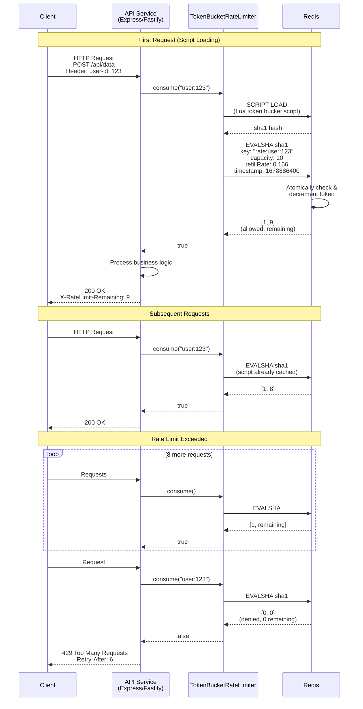
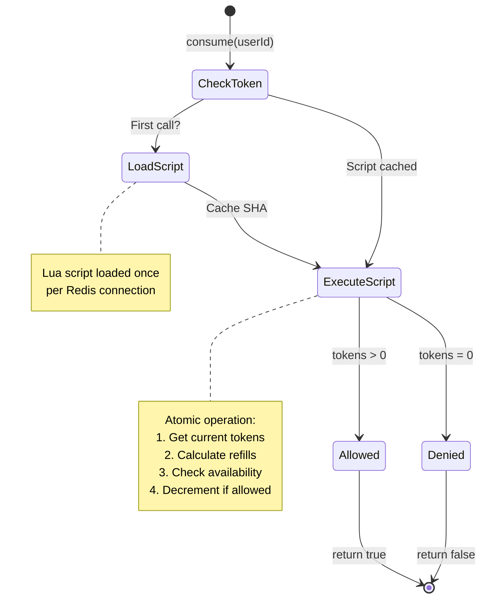

# gratheon/rate-limiter

A high-performance, distributed rate limiting library for TypeScript/Node.js applications, utilizing the **Token Bucket** algorithm and Redis Lua scripts for atomic operations.

This library is designed to be integrated into various services within the `gratheon` ecosystem (e.g., `graphql-router`, `telemetry-api`, etc.) to control traffic flow and prevent abuse.

## Algorithm: Token Bucket

- **Allows Bursts:** Tokens accumulate during low-traffic periods, enabling high burst capacity when needed.
- **Atomic Operation:** Uses Redis Lua scripts to ensure read, calculation, and write-back occur in a single atomic step, which is essential for accuracy in horizontally scaled (distributed) applications.

## Architecture & Flow

### Sequence Diagram

The following diagram shows how the rate limiter integrates into a typical API service flow:



### Token Bucket State Flow



## Installation

```bash
npm install @gratheon/rate-limiter redis
```

*(Note: The actual package name may need to be scoped to `@gratheon/rate-limiter` upon publishing.)*

## Running Tests

First, install development dependencies:

```bash
npm install
```

Then, run the tests using Jest:

```bash
npm test
```

## Usage

### Initialization

First, you need a connected Redis client.

```typescript
import { createClient } from 'redis';
import { TokenBucketRateLimiter } from './src/TokenBucketRateLimiter'; // or '@gratheon/rate-limiter'

const redisClient = createClient({
  url: 'redis://localhost:6379'
});

await redisClient.connect();

const rateLimiter = new TokenBucketRateLimiter({
  redisClient: redisClient,
  // 5 requests per minute, with a burst capacity of 10
  capacity: 10,
  refillRate: 10 / 60, // 0.166 tokens per second (10 tokens / 60 seconds)
  prefix: 'api:user' // Prefix for Redis keys (e.g., api:user:123)
});
```

### Consuming a Token

Use the `consume` method inside your middleware or route handler.

```typescript
async function handleRequest(userId: string): Promise<Response> {
  const allowed = await rateLimiter.consume(userId);

  if (!allowed) {
    return new Response('Rate Limit Exceeded', { 
      status: 429,
      headers: { 'Retry-After': '5' } // Inform client when to retry (in seconds)
    });
  }

  // Proceed with request logic
  // ...
  return new Response('OK');
}
```