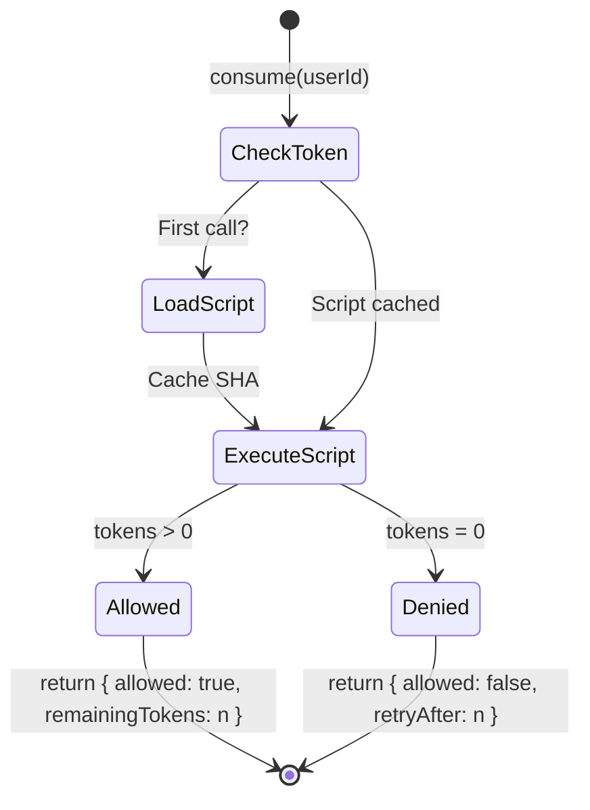

# gratheon/rate-limiter

A high-performance, distributed rate limiting library for TypeScript/Node.js applications, utilizing the **Token Bucket** algorithm and Redis Lua scripts for atomic operations.

This library is designed to be integrated into various services within the `gratheon` ecosystem (e.g., `graphql-router`, `telemetry-api`, etc.) to control traffic flow and prevent abuse.

## Features

- **Token Bucket Algorithm**: Allows bursts while maintaining steady-state rate limits
- **Atomic Operations**: Uses Redis Lua scripts for thread-safe, distributed rate limiting
- **Express Middleware**: Built-in middleware with standardized rate limit headers
- **Enhanced API**: Get status, batch consume, reset buckets, and detailed response info
- **TTL Management**: Automatic key expiration to prevent Redis memory buildup
- **Input Validation**: Validates all configuration parameters
- **Error Handling**: Graceful degradation when Redis is unavailable
- **Comprehensive Testing**: Unit and integration test coverage

## Algorithm: Token Bucket

- **Allows Bursts:** Tokens accumulate during low-traffic periods, enabling high burst capacity when needed.
- **Atomic Operation:** Uses Redis Lua scripts to ensure read, calculation, and write-back occur in a single atomic step, which is essential for accuracy in horizontally scaled (distributed) applications.

## Installation

```bash
npm install @gratheon/rate-limiter redis

# Optional: For Express middleware support
npm install express
```

## Usage

### Basic Usage

```typescript
import { createClient } from 'redis';
import { TokenBucketRateLimiter } from '@gratheon/rate-limiter';

const redisClient = createClient({ url: 'redis://localhost:6379' });
await redisClient.connect();

const limiter = new TokenBucketRateLimiter({
  redisClient,
  capacity: 10,        // 10 requests burst capacity
  refillRate: 1,       // 1 token per second
  prefix: 'api:user',
  ttlSeconds: 600,     // Optional: key TTL (auto-calculated if not provided)
});

// Consume a token
const result = await limiter.consume('user123');
if (!result.allowed) {
  console.log(`Rate limited! Retry after ${result.retryAfter} seconds`);
}
```

### Enhanced API

#### Consume with Detailed Response

```typescript
const result = await limiter.consume('user123');
// Returns: { allowed: boolean, remainingTokens: number, retryAfter?: number }

console.log(result.allowed);        // true/false
console.log(result.remainingTokens); // 9 (after consuming 1 from capacity 10)
console.log(result.retryAfter);      // undefined if allowed, seconds if denied
```

#### Get Bucket Status (without consuming)

```typescript
const status = await limiter.getStatus('user123');
// Returns: { remainingTokens: number, capacity: number, resetTime?: Date }

console.log(status.remainingTokens); // Current available tokens
console.log(status.capacity);        // Maximum capacity
console.log(status.resetTime);       // When bucket will be full again
```

#### Batch Consume Multiple Tokens

```typescript
const result = await limiter.consumeBatch('user123', 5);
// Consumes 5 tokens at once

if (result.allowed) {
  console.log(`Consumed 5 tokens, ${result.remainingTokens} remaining`);
}
```

#### Reset/Clear Bucket

```typescript
const wasDeleted = await limiter.reset('user123');
// Removes rate limit data for user, returns true if key existed
```

### Express Middleware

```typescript
import express from 'express';
import { createRateLimitMiddleware, createRateLimitStatusMiddleware } from '@gratheon/rate-limiter';

const app = express();

// Basic rate limiting by IP
app.use(createRateLimitMiddleware(limiter));

// Rate limiting by user ID (with custom options)
app.use('/api/protected', createRateLimitMiddleware(limiter, {
  keyGenerator: (req) => req.user?.id || req.ip,
  capacity: 50,
  refillRate: 5,
  skip: (req) => req.path === '/health',  // Skip health checks
}));

// Custom rate limit exceeded handler
app.use(createRateLimitMiddleware(limiter, {
  onLimitReached: (req, res, next, result) => {
    res.status(429).json({
      error: 'Rate limit exceeded',
      retryAfter: result.retryAfter,
    });
  },
}));

// Rate limit status endpoint
app.get('/api/rate-limit-status', createRateLimitStatusMiddleware(limiter), (req, res) => {
  res.json({
    limit: req.rateLimitStatus.capacity,
    remaining: req.rateLimitStatus.remainingTokens,
    resetTime: req.rateLimitStatus.resetTime,
  });
});
```

### Middleware Response Headers

The middleware automatically adds these headers:

- `X-RateLimit-Limit`: Maximum requests allowed
- `X-RateLimit-Remaining`: Remaining requests in current window
- `X-RateLimit-Reset`: Unix timestamp when bucket resets (status middleware)
- `Retry-After`: Seconds to wait before retry (when rate limited)

### Error Handling

The rate limiter validates all configuration and provides detailed errors:

```typescript
import { RateLimiterError } from '@gratheon/rate-limiter';

try {
  const limiter = new TokenBucketRateLimiter({
    capacity: -5,  // Invalid: throws RateLimiterError
    refillRate: 1,
    prefix: 'api',
    redisClient,
  });
} catch (error) {
  if (error instanceof RateLimiterError) {
    console.error('Configuration error:', error.message);
  }
}
```

The Express middleware fails open (allows requests) when Redis is unavailable, ensuring your service remains available even if the rate limiter encounters issues.

## Configuration Options

### RateLimiterConfig

| Option | Type | Required | Description |
|--------|------|----------|-------------|
| `redisClient` | RedisClientType | Yes | Connected Redis client |
| `capacity` | number | Yes | Maximum tokens in bucket |
| `refillRate` | number | Yes | Tokens added per second |
| `prefix` | string | Yes | Redis key prefix |
| `ttlSeconds` | number | No | Key TTL (auto-calculated if omitted) |

### ExpressMiddlewareConfig

| Option | Type | Default | Description |
|--------|------|---------|-------------|
| `keyGenerator` | function | `req.ip` | Extract client identifier from request |
| `skip` | function | - | Skip rate limiting for certain requests |
| `onLimitReached` | function | - | Custom handler for rate limit exceeded |
| `includeHeaders` | boolean | `true` | Include rate limit headers |
| `headers` | object | - | Custom header names |

## Running Tests

### Unit Tests

```bash
npm run test:unit
```

### Integration Tests (requires Redis)

```bash
# Start Redis
docker run -d -p 6379:6379 redis:latest

# Run tests
npm run test:integration
```

### All Tests

```bash
npm test
```

## Architecture

### Token Bucket State Flow



### Redis Key Structure

Keys are stored as Redis Hashes with the following structure:
- `tokens`: Current available tokens
- `timestamp`: Last refill timestamp

Keys have an automatic TTL to prevent memory buildup.

## API Reference

### TokenBucketRateLimiter

#### Constructor

```typescript
new TokenBucketRateLimiter(config: RateLimiterConfig)
```

Validates configuration and throws `RateLimiterError` for invalid parameters.

#### Methods

- `consume(clientId: string): Promise<ConsumeResult>` - Consume one token
- `consumeBatch(clientId: string, tokens: number): Promise<ConsumeResult>` - Consume multiple tokens
- `getStatus(clientId: string): Promise<BucketStatus>` - Get bucket status without consuming
- `reset(clientId: string): Promise<boolean>` - Clear bucket for client
- `getConfig(): Readonly<RateLimiterConfig>` - Get configuration

### Express Middleware

- `createRateLimitMiddleware(limiter, config?)` - Rate limiting middleware
- `createRateLimitStatusMiddleware(limiter, config?)` - Status middleware

## License

ISC
